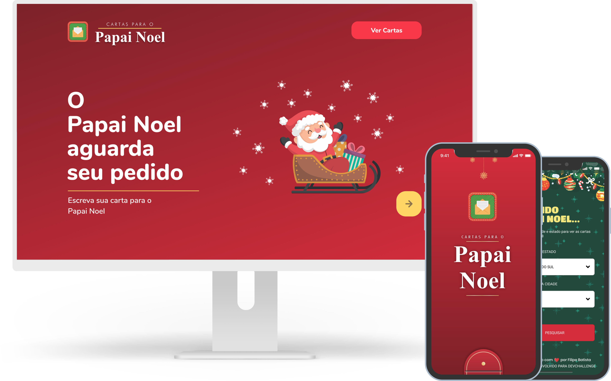

<p align="center">
    <a href="https://discord.gg/yvYXhGj">
        
        <br /> Devchallenge
    </a>
<p>

---



# Índice

- [Sobre](#-sobre)
- [Tecnologias](#Tecnologias)
- [Download](#Download)
- [Como baixar o projeto](#-como-baixar-o-projeto)


## 🔖&nbsp; Sobre

Projeto desenvolvido para a comunidade do [DevChallenge](https://discord.gg/yvYXhGj), se quiser pode acessar o site e ver os desafios feitos para a comunidade do DevChallenge [AQUI](https://www.devchallenge.com.br/).

## Objetivo
 Exercitar os conhecimentos da stack JS, ReactSJ, React Native e no backend NodeJS com express.

---
## Tecnologias

Esse projeto foi desenvolvido com as seguintes tecnologias:

- [Node.js](https://nodejs.org/en/)
- [React](https://reactjs.org)
- [React Native](https://facebook.github.io/react-native/)
- [Expo](https://expo.io/)

---
## Download

<p>
    <a href="./.github/#">
        
    </a>
</p>

---

## 🗂 Como baixar o projeto

```bash
# Clonar o repositório
    $ git clone https://github.com/devchallenge-io/workshop-cartas-papai-noel.git

# Entrar no diretório desejado
    $ cd workshop-cartas-papai-noel\mobile
    # Ou
    $ cd workshop-cartas-papai-noel\server
    # Ou
    $ cd workshop-cartas-papai-noel\web

     # Instalar as dependências
    $ yarn install

    # Iniciar o projeto
    $ yarn start
```

---

<h3 align="center" >Vamos nos conectar 😉</h3>
<p align="center">
  <a href="https://www.linkedin.com/company/devchallenge/">
    
  </a>&ensp;
  <a href="mailto:contato@devchallenge.com.br">
    
  </a>&ensp;
  <a href="https://instagram.com/devchallenge">
    
  </a>
</p>
<br />
<p align="center">
    Desenvolvido 💜 por <a href="https://instagram.com/filipeleonelbatista"> Filipe Batista </a>
</p>
