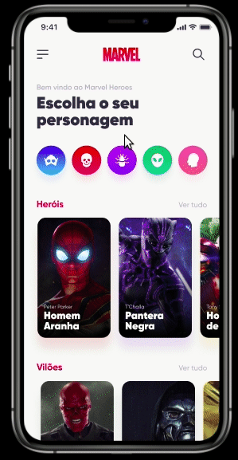

 

  

  <h3 align="center">Heroes of Marvel</h3>

  

    Escolha seu personagem preferido da Marvel!
        
     
    <a href="https://github.com/Lorenalgm/marvel-heroes">Desafio</a>
    ·
    <a href="https://devchallenge.now.sh/">DevChallenge</a>
  

# Devchallenge
<a href="https://devchallenge.now.sh/"> DevChallenge</a> permite que você evolua suas skills como programador! Participe da nossa <a href="https://discord.gg/yvYXhGj">comunidade</a> o/

# Desafio
O desafio foi criar um aplicativo listando os personagens da Marvel, com suas informações, habilidades e filmes! 

## Dados
Para listar os dados, você pode utilizar o arquivo application.json, disponível na pasta `./assets > application.json`  
Ou se preferir, pode buscar os dados na API na Marvel, dá uma olhadinha na documentação: https://developer.marvel.com/

## Modelo:
O modelo está disponivel no figma da umpontoseis: https://www.figma.com/community/file/849367817302905364 
Para utilizar o modelo do figma, basta clicar em "duplicate"

# Compartilhe!
Faça o desáfio também, usando React Native, Vue Native, Flutter ou a linguagem que você preferir.
Faça um print, gif ou vídeo e compartilhe o resultado no seu Linkedin 

Desafio criado por  <a href="https://umpontoseis.com/">umpontoseis</a> :)